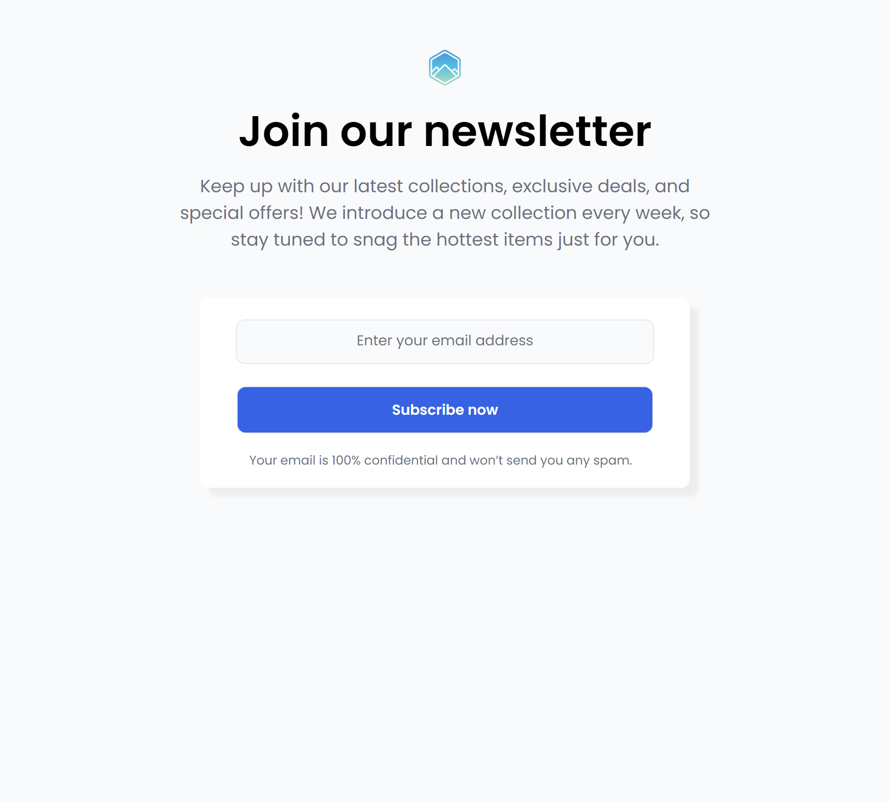

# Formulario de Suscripción a Boletín Informativo

Este es un proyecto de **Formulario de Suscripción a Boletín Informativo** creado con **HTML** y **CSS**. La aplicación tiene como objetivo permitir que los usuarios se suscriban a un boletín informativo para recibir actualizaciones sobre colecciones, ofertas exclusivas y promociones especiales.

## Características

- **Interfaz limpia**: Un diseño sencillo y moderno para mejorar la experiencia del usuario.
- **Formulario funcional**: Incluye un campo para ingresar la dirección de correo electrónico.
- **Responsive Design**: El diseño se adapta a diferentes tamaños de pantalla, asegurando una visualización correcta tanto en dispositivos móviles como en pantallas más grandes.
- **Mensajes de privacidad**: Incluye una nota sobre la confidencialidad de los datos del usuario.

## Tecnologías Utilizadas

- **HTML**: Para la estructura del formulario.
- **CSS**: Para el estilo y el diseño visual del formulario.
- **Google Fonts**: Para utilizar la fuente "Poppins" y mejorar la apariencia tipográfica.

## Vista Previa del Proyecto



## Cómo Ejecutarlo Localmente

1. Clona el repositorio:
    ```bash
    git clone https://github.com/tu-usuario/nombre-del-repositorio.git
    ```
2. Navega a la carpeta del proyecto:
    ```bash
    cd nombre-del-repositorio
    ```
3. Abre el archivo `index.html` en tu navegador.

## Estructura del Proyecto

```bash
/
├── index.html
├── style.css
├── img/
│   └── logo-newsletter.svg
└── README.md
